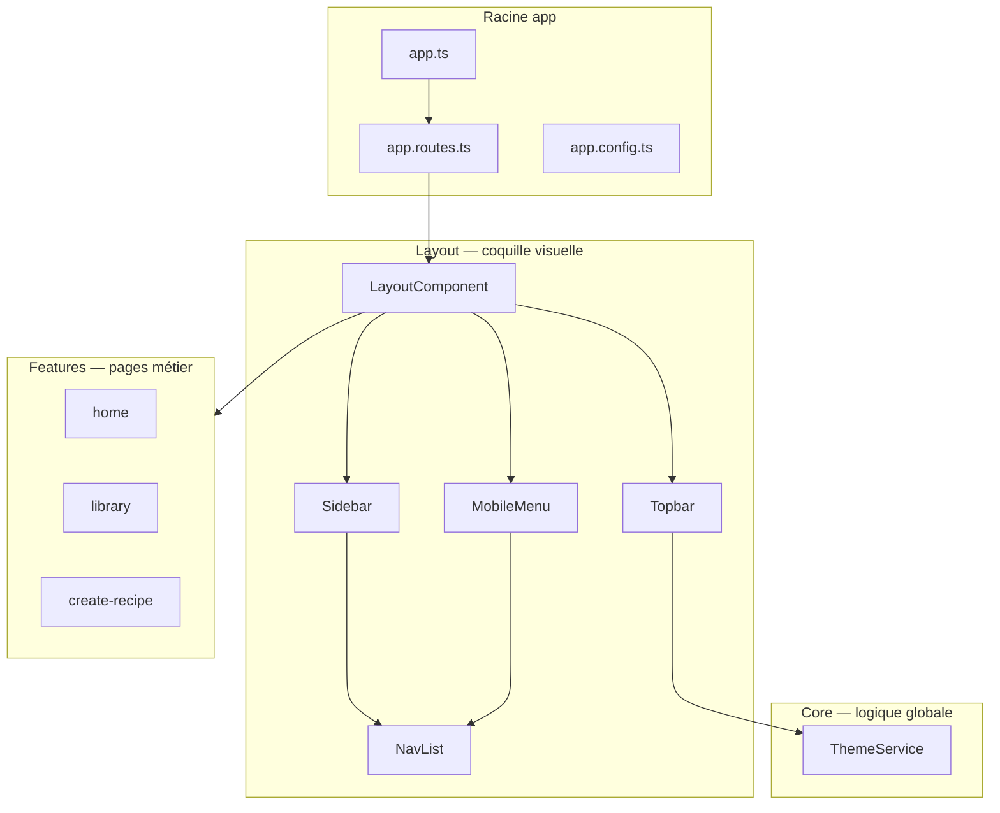

# MiamBook — Frontend Angular

Interface web de **MiamBookV2** : **Angular 21** (composants standalone), **PrimeNG** et **PrimeIcons**.  
Elle consomme l’API **NestJS** (voir [backend/README.md](../backend/README.md)) et, en production, les données **PostgreSQL** via cette API.

---

## Démarrage rapide

### Prérequis

- **Node.js** 20+ (recommandé)
- **npm** 9+

### Installation

```bash
cd frontend-angular
npm install
```

### Lancer en développement

```bash
npm start
```

Ouvre [http://localhost:4200](http://localhost:4200).  
Les modifications de code sont rechargées automatiquement (live reload).

**Avec l’API :** lancer le backend sur le port **3333** (`npm run start:dev` dans `backend/`), puis mettre `useMockData: false` dans `src/environments/environment.development.ts`. Le proxy dev envoie `/api` vers NestJS (`proxy.conf.json`).

### Autres commandes

| Commande        | Description                          |
|-----------------|--------------------------------------|
| `npm run build` | Build de production → `dist/`        |
| `npm test`      | Tests unitaires (Vitest)             |
| `npm run watch` | Build en mode watch (développement)  |

---

## Vue d’ensemble

L’application est organisée en **couches** pour garder le code lisible et évolutif :



**En une phrase :**  
`app` démarre l’application → `layout` affiche la barre du haut et le menu → `features` contient le contenu de chaque page → `core` fournit les services globaux.

---

## Structure des dossiers

```
frontend-angular/
├── src/
│   ├── main.ts                 # Point d’entrée (bootstrap Angular)
│   ├── index.html
│   ├── styles.css              # Import des feuilles globales
│   ├── styles/
│   │   ├── tokens.css          # Variables CSS (couleurs, thème clair/sombre)
│   │   ├── base.css            # Reset / html, body
│   │   └── components.css      # Classes globales (.btn, .avatar…)
│   └── app/
│       ├── app.ts              # Composant racine (<router-outlet />)
│       ├── app.config.ts       # Providers (router, PrimeNG, animations…)
│       ├── app.routes.ts       # Routes racine (délègue au layout)
│       │
│       ├── core/               # Services singletons, sans interface
│       │   ├── services/
│       │   │   └── theme.service.ts
│       │   └── index.ts
│       │
│       ├── shared/             # Composants UI réutilisables (à ajouter au besoin)
│       │
│       ├── layout/             # Shell : topbar, sidebar, menu mobile
│       │   ├── layout.component.*
│       │   ├── layout.routes.ts
│       │   ├── constants/
│       │   │   └── nav-links.constant.ts
│       │   ├── models/
│       │   │   └── nav-link.model.ts
│       │   └── components/
│       │       ├── topbar/
│       │       ├── sidebar/
│       │       ├── mobile-menu/
│       │       └── nav-list/     # Liste de liens partagée
│       │
│       └── features/           # Une feature = un domaine / une page
│           ├── home/
│           │   ├── home.component.ts
│           │   └── home.routes.ts
│           ├── library/
│           ├── recipe-details/
│           └── create-recipe/
│
├── angular.json
├── package.json
└── tsconfig.app.json           # Alias de chemins (@core, @shared…)
```

---

## Rôle de chaque couche

### `app/` (racine)

Fichiers **uniques** qui configurent toute l’application :

- **`app.ts`** — contient uniquement `<router-outlet />` : pas de logique métier ici.
- **`app.config.ts`** — enregistre le routeur, les animations, PrimeNG, etc.
- **`app.routes.ts`** — importe les routes du layout (`layoutRoutes`).

### `core/`

**Services globaux** utilisés partout, injectés une seule fois (`providedIn: 'root'`).

| Exemple actuel | Rôle |
|----------------|------|
| `ThemeService` | Thème clair / sombre, persistance `localStorage` (`miambook-theme`) |

**Règle :** `core` ne doit **pas** importer de composants UI (`shared`, `layout`, `features`).

### `shared/`

Dossier réservé aux **composants UI réutilisables** (pipes, directives, widgets) sans logique métier.  
Les icônes passent par **[PrimeIcons](https://primeng.org/icons)** (pas de composant maison).

### `layout/`

**Coquille de l’application** : ce qui entoure le contenu des pages.

| Composant | Rôle |
|-----------|------|
| `LayoutComponent` | Assemble topbar + sidebar + zone `<router-outlet>` |
| `TopbarComponent` | Logo MiamBook, thème, réglages, avatar |
| `SidebarComponent` | Menu latéral (desktop, ≥ 768px) |
| `MobileMenuComponent` | Drawer + overlay (mobile) |
| `NavListComponent` | Liens Accueil / Bibliothèque / Créer une recette (évite la duplication) |

Les **liens de navigation** vivent ici (`nav-links.constant.ts`), car ils appartiennent au shell, pas au métier.

### `features/`

**Pages et logique métier** par domaine fonctionnel.

Chaque feature contient en général :

- un **composant** (`*.component.ts`) — ce que l’utilisateur voit ;
- un fichier **routes** (`*.routes.ts`) — comment y accéder par URL.

| Feature | URL | Statut |
|---------|-----|--------|
| `home` | `/` | Placeholder |
| `library` | `/bibliotheque` | Liste recettes (API + PrimeNG) |
| `recipe-details` | `/recette/:recipeId` | Détail recette (API + PrimeNG) |
| `create-recipe` | `/createRecipe` | Formulaire création (PrimeNG, bouchon) |

Pour une nouvelle page, ajoutez un dossier sous `features/` et branchez ses routes dans `layout.routes.ts`.

---

## Règles de dépendances

Pour éviter le code spaghetti, respectez ce sens d’import :

```
features  →  layout, shared, core
layout    →  core
shared    →  (rien dans app/ sauf librairies npm)
core      →  (rien dans app/ sauf librairies npm)
```

**Interdit :**

- `core` qui importe `shared` ou un composant de feature ;
- `shared` qui importe `layout` ou `features`.

---

## Routing

Le flux est le suivant :

1. `app.routes.ts` charge `layoutRoutes`.
2. `layout.routes.ts` affiche `LayoutComponent` et déclare les **enfants** :
   - `home.routes.ts` → `path: ''`
   - `library.routes.ts` → `path: 'bibliotheque'`
   - `recipe-details.routes.ts` → `path: 'recette/:recipeId'`
   - `create-recipe.routes.ts` → `path: 'createRecipe'`
3. Chaque feature utilise `loadComponent` pour le **lazy loading** (le code de la page n’est chargé que quand on y va).

Schéma simplifié :

```
/  ──► LayoutComponent
         ├── (sidebar + topbar toujours visibles)
         └── <router-outlet>
               ├── ''                    → HomeComponent
               ├── bibliotheque          → LibraryComponent (GET /recipes)
               ├── recette/:recipeId     → RecipeDetailsComponent (GET /recipes/:id)
               └── createRecipe          → CreateRecipeComponent
```

---

## Données recettes (bouchon / API)

**Service unique :** `core/services/recipe-data.service.ts`  
Bascule selon `environment.useMockData`.

| `useMockData` | Source | Fichiers / service |
|---------------|--------|---------------------|
| `true` (défaut dev) | 16 recettes locales | `core/data/bouchon-*.ts`, `recipe-bouchon.service.ts` |
| `false` | API NestJS → PostgreSQL | `recipe-api.service.ts` (`GET /recipes`, `GET /recipes/:id`) |

Activer l’API :

```typescript
// src/environments/environment.development.ts
useMockData: false,
apiUrl: '/api', // proxy dev → http://localhost:3333
```

Puis : migrations + `npm run start:dev` dans `backend/`, et `npm start` ici.

**Comportement des bouchons (mode démo sans BDD) :**

- Recette **id `1`** (Tarte aux pommes) → ingrédients, étapes, équipement complets
- Recettes **id `2`–`16`** → fiche simplifiée
- Id inconnu → « Recette introuvable »

---

## Alias de chemins

Dans `tsconfig.app.json`, des raccourcis évitent les imports du type `../../../` :

| Alias | Dossier |
|-------|---------|
| `@core/*` | `src/app/core/*` |
| `@shared/*` | `src/app/shared/*` |
| `@layout/*` | `src/app/layout/*` |
| `@features/*` | `src/app/features/*` |

**Exemple :**

```typescript
import { ThemeService } from '@core/services/theme.service';
```

---

## Icônes (PrimeIcons)

Les icônes utilisent la librairie **[PrimeIcons](https://primeng.org/icons)** fournie avec PrimeNG.

Le CSS est importé dans `src/styles.css` :

```css
@import 'primeicons/primeicons.css';
```

**Dans un template :**

```html
<i class="pi pi-home" aria-hidden="true"></i>
```

**Dans la navigation** (`nav-links.constant.ts`), chaque lien définit sa classe :

```typescript
{ path: '/', label: 'Accueil', icon: 'pi pi-home' }
```

**Sur un composant PrimeNG :**

```html
<p-button icon="pi pi-check" label="Valider" />
```

Liste complète des noms : [primeng.org/icons](https://primeng.org/icons)

---

## Styles globaux

On utilise des **variables CSS** et des classes utilitaires dans `src/styles/`.

| Fichier | Contenu |
|---------|---------|
| `tokens.css` | Couleurs, largeur sidebar (`13rem`), hauteur topbar (`3rem`) |
| `base.css` | `html`, `body`, overflow |
| `components.css` | `.btn`, `.btn-ghost`, `.btn-nav`, `.avatar` |

Le thème clair/sombre est piloté par la classe `.dark` sur `<html>`, via `ThemeService`.

---

## Stack technique

| Technologie | Usage |
|-------------|--------|
| **Angular 21** | Framework, composants standalone |
| **Angular Router** | Navigation, lazy loading |
| **PrimeNG 21** | Composants UI (boutons, tables, formulaires…) |
| **PrimeIcons** | Icônes (`pi pi-*`) |
| **RxJS** | Flux asynchrones (HTTP, état) |
| **TypeScript 5.9** | Typage strict |
| **Vitest** | Tests unitaires |
| **Prettier** | Formatage (`.prettierrc`, parser `angular` pour les templates HTML) |

**Backend associé :** NestJS, MikroORM, PostgreSQL — voir [../backend/README.md](../backend/README.md).

---

## Ajouter une nouvelle feature (guide)

Exemple : page **Favoris** à l’URL `/favoris`.

### 1. Créer le dossier

```
src/app/features/favorites/
├── favorites.component.ts
└── favorites.routes.ts
```

### 2. Définir les routes

```typescript
// favorites.routes.ts
import { Routes } from '@angular/router';

export const favoritesRoutes: Routes = [
  {
    path: 'favoris',
    loadComponent: () =>
      import('./favorites.component').then((m) => m.FavoritesComponent),
  },
];
```

### 3. Brancher dans le layout

```typescript
// layout/layout.routes.ts
import { favoritesRoutes } from '@features/favorites/favorites.routes';

children: [
  ...homeRoutes,
  ...libraryRoutes,
  ...recipeDetailsRoutes,
  ...createRecipeRoutes,
  ...favoritesRoutes,
],
```

### 4. (Optionnel) Lien dans la navigation

Éditer `layout/constants/nav-links.constant.ts`.

### 5. PrimeNG

Importer les composants PrimeNG dans le tableau `imports` du composant standalone.

---

## Conventions de nommage

| Élément | Convention | Exemple |
|---------|------------|---------|
| Dossier feature | kebab-case | `create-recipe/` |
| Composant | PascalCase + `Component` | `CreateRecipeComponent` |
| Fichier composant | kebab-case | `create-recipe.component.ts` |
| Routes | `*.routes.ts` | `home.routes.ts` |
| Constantes | `*.constant.ts` | `nav-links.constant.ts` |
| Service | `*.service.ts` | `theme.service.ts` |
| Sélecteur | préfixe `app-` | `app-home` |

---

## Questions fréquentes

**Pourquoi `npm start` et pas `npm run dev` ?**  
Le script défini dans `package.json` est `"start": "ng serve"`. Les deux feraient la même chose ; seul `start` est configuré.

**Où mettre un formulaire de création de recette ?**  
Dans `features/create-recipe/` (composant + éventuellement un `*.service.ts` si appels API).

**Où mettre un interceptor HTTP ou un guard ?**  
Dans `core/` (ex. `core/interceptors/`, `core/guards/`) et enregistrement dans `app.config.ts`.

**Quelle librairie d’icônes utiliser ?**  
Toujours **PrimeIcons** (`pi pi-*`). Voir [primeng.org/icons](https://primeng.org/icons).

---

## Ressources

- [Documentation Angular](https://angular.dev)
- [Documentation PrimeNG](https://primeng.org)
- [PrimeIcons](https://primeng.org/icons)
- [Angular CLI](https://angular.dev/tools/cli)
- [README du monorepo](../README.md)
- [README backend](../backend/README.md)
